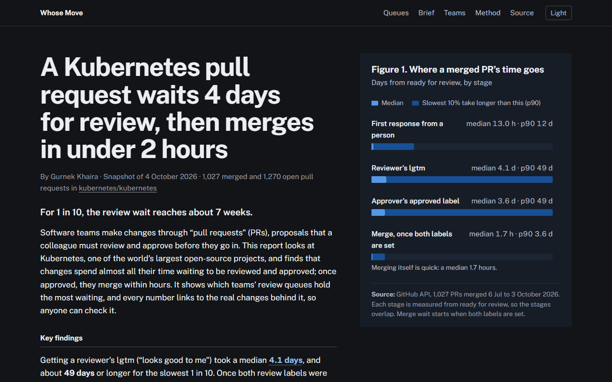

# Whose Move

Shows where pull requests wait in a large engineering org, by team (SIG) and review stage. Version 1 is a snapshot of `kubernetes/kubernetes`, built from public GitHub data. (Earlier called Delivery Bottleneck Analyzer; the repository keeps that name so existing links work.)

Live report: https://delivery-bottleneck-analyzer-site.vercel.app



Kubernetes already publishes detailed PR-velocity charts through CNCF DevStats. This project answers a narrower question that DevStats spreads across several dashboards: right now, whose move is each open PR waiting on, and which team-and-stage queue holds the most waiting? It reads timelines directly from GitHub's API, ranks queues by PR-days of waiting, links every number to its PRs, and writes a short cited brief. It is a single snapshot, not a trend chart, and it doesn't measure reviewer capacity. [Existing tools](research/existing-tools.md) compares it with DevStats and commercial products.

Built by Gurnek Khaira with AI coding agents (Claude Code), working from a product spec ([PRD.md](PRD.md)), [decision records](docs/adr/) and [tickets](.scratch/v1/issues/). [BUILD-REPORT.md](BUILD-REPORT.md) covers what was built and checked, [FINDINGS.md](FINDINGS.md) the live test, and [LEARNINGS.md](LEARNINGS.md) what the build taught.

## What it measures

Each merged PR's time is split into stages, all measured from the moment it became ready for review:

| Stage | From → to |
|---|---|
| First response | ready → first comment or review by a human other than the author |
| Review | ready → final `lgtm` label |
| Approval | ready → final `approved` label |
| Merge wait | both labels set → merged (CI and the merge queue) |

Each open PR goes into exactly one backlog state, according to whose move it is: no human response yet, waiting on review, waiting on approval, waiting to merge, waiting on the author, or on hold.

Queues are ranked by PR-days of waiting, which is the number of open PRs in a team-and-stage queue multiplied by their median wait. A queue ranks high if many PRs are stuck in it, if they've been stuck a long time, or both.

## Findings (snapshot of 2026-10-04)

These come from 1,027 PRs merged between 2026-07-06 and 2026-10-03 and all 1,270 PRs open on 2026-10-04.

A Kubernetes pull request waits about 4 days for review, then merges in under 2 hours. The median merged PR took 7.3 days from ready to merged. Reaching lgtm took 4.1 days at the median, and about 49 days or longer for the slowest 1 in 10 (roughly 7 weeks). Once both labels were set, the median PR merged in 1.7 hours.

Two review queues hold the most waiting. sig/api-machinery has 120 open PRs waiting for review, with a median wait of 85 days (10,198 PR-days). sig/node also has 120, waiting a median 75 days (9,032 PR-days).

272 open PRs, 21% of the backlog, have had no human response. Their median wait is 41 days, and 94 of them belong to sig/api-machinery, the third-largest queue overall.

Waiting on the author is about as common as waiting on a reviewer: 337 open PRs need a rebase, requested changes or a process label from their author, against 368 waiting for review.

The main finding agrees with Kubernetes' own DevStats. Recomputing DevStats' "PR Time to Approve and Merge" definitions on this data, for PRs created in August and September 2026, shows the same pattern: most of the time goes to waiting for lgtm, and merging after approval takes hours at the median. The medians differ by 16 to 28%; the [cross-check](research/devstats-cross-check.md) covers the likely causes.

The numbers are a snapshot of 2026-10-04. `npm run snapshot` refreshes it.

## Method and limits

- Review and approval come from the `lgtm` and `approved` labels that Kubernetes' merge bot (Prow) sets. When a label is removed and added again, the final add counts, so rework shows up as review time.
- Bots and the PR's own author never count as a response. Some Kubernetes bots are registered as ordinary users, so a fixed list of bot logins is excluded as well (`src/bots.js`).
- The page reports medians and p90, never means. A group with fewer than 10 PRs shows `—` and is never ranked.
- A PR labeled with more than 3 SIGs, usually a dependency bump, is reported as cross-cutting so it doesn't count toward every SIG.
- Labels are a proxy. A PR waiting on a reviewer who is away looks the same as one waiting because the change is hard.
- The unit of analysis is a team and a stage, never a person ([ADR 0004](docs/adr/0004-teams-and-stages-not-people.md)).

A small LLM, called through OpenRouter, writes the risks brief from the computed numbers. Each bullet has to cite PRs from its input, and every number in it has to appear in the computed facts. Code rejects any bullet that breaks those rules, along with known misreadings of the data. For example, a bullet saying the merge queue is slow is rejected with the evidence that merging takes 1.7 hours at the median. If no brief passes, the snapshot ships without one. The script prints a cost estimate before each call and refuses to run above US$0.05. Earlier model outputs are kept in `eval/brief/history/` as regression cases.

## Run locally

```bash
export GITHUB_TOKEN=$(gh auth token)
npm run snapshot # fetch + metrics + brief cost estimate (no paid call), about 6 minutes

# or step by step:
npm run fetch   # about 6 minutes, roughly 320 of GitHub's 5,000 hourly API points
npm run metrics # SIG rollups and bottleneck ranking, writes site/data/metrics.json
npm run serve   # dashboard at http://localhost:8080
npm run brief -- --dry-run   # prints the estimated cost, makes no call (needs OPENROUTER_MODEL)
npm run brief                # paid: writes site/data/brief.json (needs OPENROUTER_API_KEY in .env)
npm run brief -- --stub       # free: runs the whole brief pipeline with a stub model
npm run eval:brief           # free: scores past model outputs against ground truth
npm run score:brief -- --sheet  # writes a review sheet for a person to check the brief
npm run cross-check          # free: compares with DevStats (needs data/raw from npm run fetch)
npm test                     # 67 tests, no network: metrics, brief checks, the fetcher and the public page
```

No runtime dependencies. Requires Node 22.9 or later.

## Refreshing the snapshot

The owner refreshes the dashboard when they choose to (ADR 0009):

1. `npm run snapshot` fetches PRs, recomputes the metrics and prints the brief's cost estimate.
2. `npm run brief` writes the brief. It costs a fraction of a cent, and if it fails any check the snapshot ships without a brief.
3. `npm run score:brief -- --sheet` writes a review sheet, and a person marks each bullet before publishing.
4. Commit `site/data/` and push. Vercel serves `site/` and redeploys on each push.

The OpenRouter key stays in the local `.env`. Nothing runs on a schedule, and no key is stored on GitHub.

## License

MIT
